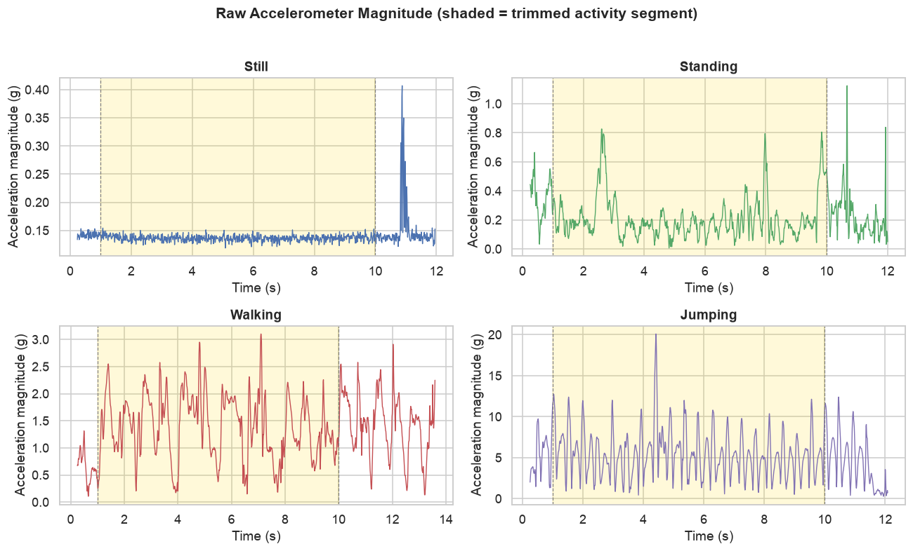
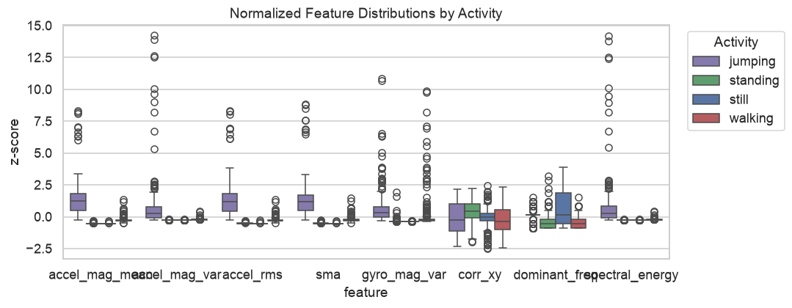
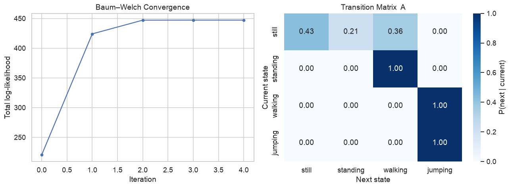
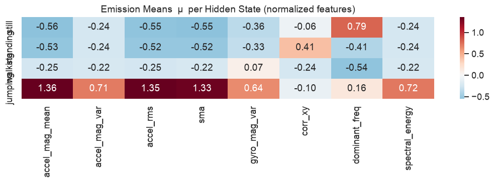
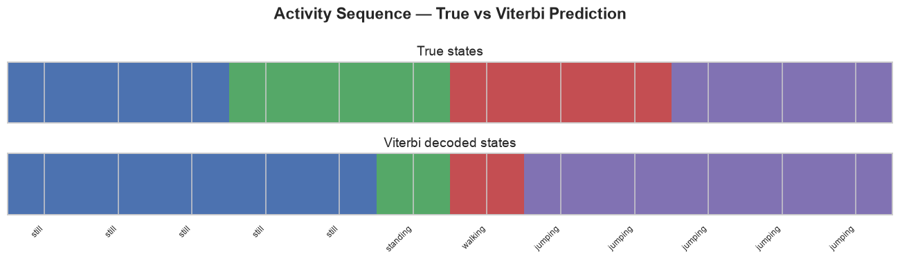
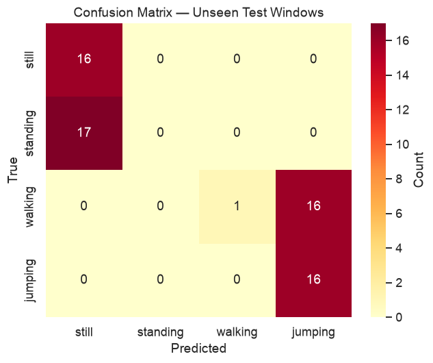

# Formative 2 — Hidden Markov Models for Human Activity Recognition

Infer human activity states (**still**, **standing**, **walking**, **jumping**) from smartphone accelerometer and gyroscope signals using a **Gaussian Hidden Markov Model (HMM)** implemented in Python.

**Author:** UTERAMAHORO Avellin Bonaparte

**Devices:** iPhone 7 Plus (iOS) · SM-G955U · SM-G970U1 (Android) · Sensor Logger  
**Sampling rate:** 100 Hz (harmonized across devices)

---

## Overview

Wearable and mobile sensors produce noisy, high-frequency motion streams where the true activity is not directly observable. This project collects real motion data, engineers time- and frequency-domain features, and trains an HMM with:

- **Baum–Welch** (EM) for parameter estimation  
- **Viterbi** decoding for the most likely activity sequence  
---

## Repository structure

```
Formative2-Hidden_Markov_Models/
├── dataset/
│   ├── still-*/                    # Raw Sensor Logger exports (per activity)
│   ├── standing-*/
│   ├── walking-*/
│   ├── jumping-*/
│   ├── cleaned/                    # Trimmed, merged, resampled recordings
│   │   ├── still_full_recording.csv
│   │   ├── standing_full_recording.csv
│   │   ├── walking_full_recording.csv
│   │   ├── jumping_full_recording.csv
│   │   └── collection_summary.csv
│   └── windows/                    # Labelled 1-second window CSVs
│       ├── still/                  # still_sample_01.csv
│       ├── standing/
│       ├── walking/
│       ├── jumping/
│       └── window_manifest.csv
├── figures/                        # Plots generated by the notebook
├── scripts/
│   ├── data_utils.py               # Dataset discovery & preprocessing
│   ├── prepare_dataset.py          # Export cleaned & windowed CSV files
├── hmm_activity_recognition.ipynb  # Main notebook
├── requirements.txt
└── README.md
```

---

## Quick start

### 1. Clone and set up the environment

```bash
git clone https://github.com/Bonaparte003/Formative2-Hidden_Markov_Models.git
cd Formative2-Hidden_Markov_Models

python3 -m venv .venv
source .venv/bin/activate
pip install -r requirements.txt
```

### 2. Run the notebook

```bash
jupyter notebook hmm_activity_recognition.ipynb
```

Use **Cell → Run All**. Figures are saved to `figures/`.

### 3. Regenerate dataset exports (optional)

```bash
python scripts/prepare_dataset.py
```

This writes trimmed recordings to `dataset/cleaned/` and windowed samples to `dataset/windows/`.

### 4. Regenerate the PDF report

```bash
python scripts/generate_report_pdf.py
```

Output: `report/Formative2_HMM_Report.pdf`

---

## Data collection protocol

| Activity  | Instructions                                      | Trimmed duration |
|-----------|---------------------------------------------------|------------------|
| **Still** | Phone flat on a desk, no movement                 | 1.0 – 10.0 s     |
| **Standing** | Phone at waist level, upright and steady     | 1.0 – 10.0 s     |
| **Walking** | Consistent walking pace, phone at waist        | 1.0 – 10.0 s     |
| **Jumping** | Continuous jumps, phone secured at waist     | 1.0 – 10.0 s     |

**Sensors recorded:** Accelerometer (x, y, z) and Gyroscope (x, y, z)  
**App:** [Sensor Logger](https://github.com/tszheichoi/awesome-sensor-logger) (iOS & Android)

### Why we trim recordings

Each raw CSV is 12 s long. The first second captures phone placement and the record tap; the segment after 11 s captures the pause tap. Only **seconds 1–10** are kept so the model sees clean activity data aligned with the 5–10 s assignment specification.

### Adding new recordings

1. Export a new zip from Sensor Logger and place it in `dataset/` as `{activity}-YYYY-MM-DD_HH-MM-SS.zip`
2. Unzip into a folder with the same name prefix
3. Re-run the notebook or `scripts/prepare_dataset.py`

The pipeline auto-discovers folders whose names start with `still`, `standing`, `walking`, or `jumping` (case-insensitive, e.g. `Still6-…` and `still6-…` both work).

---

## Preprocessing pipeline

| Step | Parameter | Rationale |
|------|-----------|-----------|
| Harmonize sampling rate | 100 Hz | Each device is resampled to its native rate from metadata, then aligned to a common 100 Hz grid |
| Trim activity segment | 1.0 – 10.0 s | Remove setup / pause button artifacts |
| Window size | 100 samples (1 s) | Captures ~1 walking stride at typical cadence |
| Hop size | 50 samples (50 % overlap) | ~16 windows per trimmed recording per activity |
| Normalization | Z-score (`StandardScaler`) | Equalizes feature scales for Gaussian emissions |

---

## Features extracted (8 total)

| Feature | Domain | Purpose |
|---------|--------|---------|
| `accel_mag_mean` | Time | Separates static vs dynamic activities |
| `accel_mag_var` | Time | Movement intensity (jumping > walking > still) |
| `accel_rms` | Time | Robust vibration amplitude |
| `sma` | Time | Signal Magnitude Area across axes |
| `gyro_mag_var` | Time | Micro-sway (standing) vs desk stillness |
| `corr_xy` | Time | Orientation / coordination patterns |
| `dominant_freq` | Frequency (FFT) | Rhythmic activities have distinct peaks |
| `spectral_energy` | Frequency (FFT) | Total power in 0.5–15 Hz band |

---

## HMM design

| Component | Description |
|-----------|-------------|
| **Hidden states (Z)** | `{still, standing, walking, jumping}` |
| **Observations (X)** | 8-D Z-scored feature vectors per 1 s window |
| **Transition matrix (A)** | `P(Z_{t+1} \| Z_t)` — learned via Baum–Welch |
| **Emissions (B)** | Diagonal-covariance Gaussians per state |
| **Initial probabilities (π)** | Supervised estimate from training labels |

**Training strategy:** Emission parameters are warm-started from labelled training windows. Baum–Welch refines transition probabilities on synthetic multi-activity sequences (still → standing → walking → jumping).

**Evaluation:** Session-level hold-out of four unseen Jul 1 recordings; metrics include sensitivity, specificity, accuracy, a confusion matrix, and Viterbi decoding on test sequences.

---

## Results summary

| Metric | Value |
|--------|-------|
| Recording sessions | **87** (83 train, 4 unseen) |
| Devices | iPhone 7 Plus (63), SM-G955U (12), SM-G970U1 (12) |
| Sessions per activity | still 22 · standing 22 · walking 22 · jumping 21 |
| Labelled window CSVs | **1440** |
| Training windows | 1374 |
| Unseen test windows | 66 (4 Jul 1 sessions) |
| Overall test accuracy | **50.0 %** (Viterbi per session) |

Unseen test files: `still5`, `standing5`, `walking5`, `jumping5` (2026-07-01).

Full write-up: [`report/Formative2_HMM_Report.pdf`](report/Formative2_HMM_Report.pdf)

---

## Figures

Plots are generated by running the notebook (or already saved under `figures/`).

### Raw data



*Figure 1 — Raw accelerometer magnitude per activity, one trace per device (iPhone 7 Plus, SM-G955U, SM-G970U1).*

### Features



*Figure 2 — Z-scored feature distributions by activity (training windows).*

### HMM training & decoding



*Figure 3 — Baum–Welch log-likelihood convergence and learned transition matrix.*



*Figure 4 — Emission means μ per hidden state (normalized features).*



*Figure 5 — True vs. Viterbi-decoded sequence on a training example.*

### Unseen test evaluation



*Figure 6 — Confusion matrix on unseen test windows (Viterbi per session, 50.0 % overall accuracy).*

---

## Dependencies

```
numpy, pandas, matplotlib, seaborn, scipy, scikit-learn, jupyter
```

Listed in `requirements.txt`.